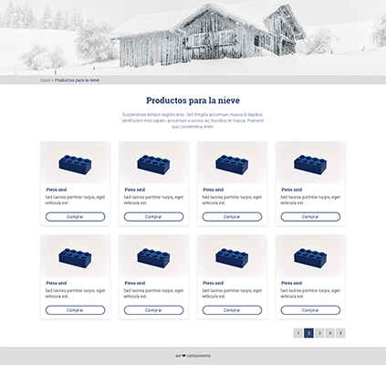

# Xmas components
## Ejercicio de maquetación por componentes 
***
Ejercicio para practicar la maquetación por componentes. En este caso hay un diseño básico preparado en [Zeplin.io](https://zeplin.io), donde se pueden comprobar medidas, colores, tipografías e incluso descargar las imágenes necesarias.

